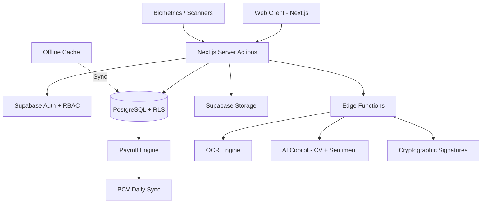

# 🇻🇪 Holos.app — Enterprise ERP & Business Super App

## 🚀 Vision

**Holos.app** — The central nervous system for corporate operations. A comprehensive B2B SaaS platform that delivers a 360° holistic management solution: HR, POS, Logistics, Fiscal Compliance, and AI-driven intelligence in a single platform built for the Venezuelan market.

---

## 🏗️ Product Architecture (20 Modules)

### Core HR (Modules 1-8)

| #   | Module                   | Key Capability                                 |
| --- | ------------------------ | ---------------------------------------------- |
| 1   | 🔍 Talent Acquisition    | AI CV screening, Fit Score, interview prompts  |
| 2   | 💰 Smart Payroll         | BCV daily sync, USD→VES indexed calculations   |
| 3   | ⚖️ Legal & Compliance    | IVSS/FAOV/INCES parafiscal alerts & reports    |
| 4   | 📈 Performance & Climate | AI sentiment analysis, turnover prediction     |
| 5   | 📁 Document Management   | Cédula/RIF validation, labor letter generation |
| 6   | 🕒 Attendance & Absence  | IVSS rest certificates, overtime/night bonuses |
| 7   | 💬 Internal Comms        | FAQ bot, mass digital paystubs, pulse surveys  |
| 8   | 🎓 Upskilling            | Content curation, Gaceta Oficial briefings     |

### Enterprise Tier (Modules 9-12)

| #   | Module                     | Key Capability                                                |
| --- | -------------------------- | ------------------------------------------------------------- |
| 9   | 🛡️ Architecture & Security | RBAC, immutable audit trail, offline-first                    |
| 10  | 📜 Document & Legal        | Cryptographic signatures, approval workflows, version control |
| 11  | ⚙️ Hardware Integration    | Biometrics, Zebra/Honeywell scanners, WMS, OCR                |
| 12  | 🎯 Finance & UX            | Multi-currency engine, white-labeling, AI dashboard           |

### Interfaces (Modules 13-14)

| #   | Module               | Key Capability                                              |
| --- | -------------------- | ----------------------------------------------------------- |
| 13  | 🏪 POS Front-Office  | Split payments, IGTF, fiscal printer, offline cache, arqueo |
| 14  | 📊 Admin Back-Office | Financial dashboard, SENIAT TXT, bank reconciliation, RBAC  |

### Tax & Audit (Module 15)

| #   | Module          | Key Capability                                                              |
| --- | --------------- | --------------------------------------------------------------------------- |
| 15  | 🏛️ Fiscal Panel | SENIAT TXT/Libros IVA, IGTF console, Reporte Z, period freeze, auditor mode |

### Logistics & Operations (Modules 16-18)

| #   | Module                   | Key Capability                                                    |
| --- | ------------------------ | ----------------------------------------------------------------- |
| 16  | 🏭 WMS & Dispatch        | Multi-warehouse, SADA/SICA guides, operator UX, last-mile         |
| 17  | 🌐 Omnichannel           | Real-time stock sync, dynamic pricing, digital picking board      |
| 18  | 🚛 Fleet & Alcabala Mode | Vehicle dossiers, driver validation, hard-stop, checkpoint QR app |

### Commercial & Supply Chain (Modules 19-20)

| #   | Module         | Key Capability                                                   |
| --- | -------------- | ---------------------------------------------------------------- |
| 19  | 🏢 B2B & CRM   | Multi-currency credit limits, smart quotes, sales pipeline       |
| 20  | 📦 Procurement | Requisition workflows, AI cost analysis, digital purchase orders |

> 📄 **Full Specs**: See [functional_specs.md](functional_specs.md) for detailed descriptions, features, and user flows.

---

## 💎 Monetization (Tiers)

| Plan         | Pricing    | Scope                                   |
| :----------- | :--------- | :-------------------------------------- |
| **Freemium** | $0         | < 3 Employees (Payroll Only)            |
| **Basic**    | $10/emp/mo | Payroll + Fiscal Reports                |
| **Standard** | $15/emp/mo | Basic + Onboarding + Benefits + AI      |
| **Premium**  | $25/emp/mo | Standard + Hardware + WMS + White-Label |

**Revenue Add-on**: 1-2% commission on payments processed via fintech partners.

---

## 🏗️ Technical Architecture

---

## 📜 Development Guidelines

- **Protocol**: Follows [Antigravity Protocol Zero](.agent/rules/protocol-zero.md).
- **Security**: Strict RLS + RBAC + immutable audit trails.
- **Quality**: TypeScript strict mode, automated build verification.

---

## 📈 Goals

- **SME Target**: Companies with 10+ employees.
- **Milestone 1**: 50-200 clients ($5k - $50k MRR).
